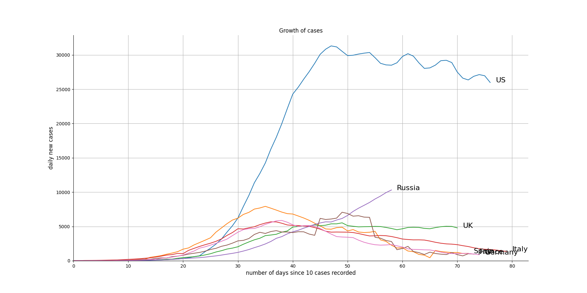
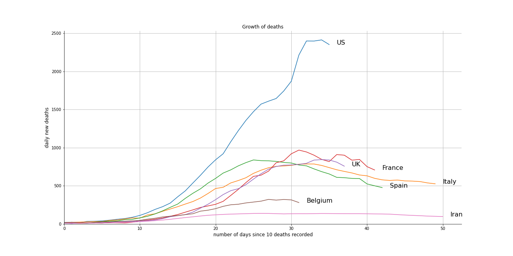
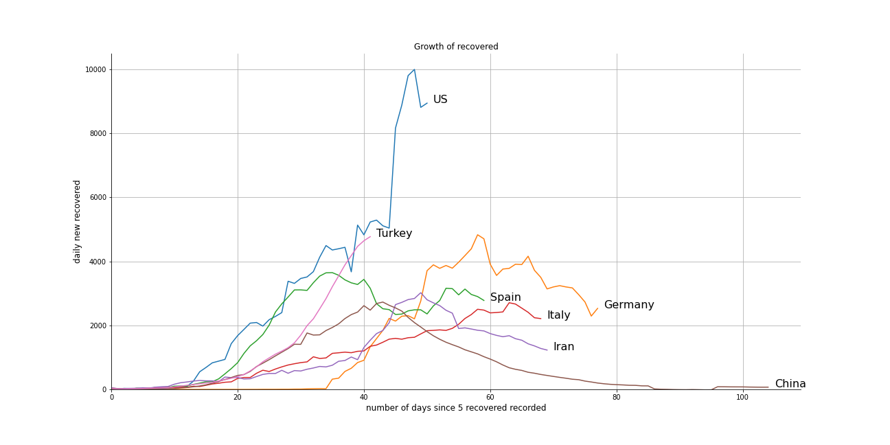

# covid-19-trend

Visualization of the COVID-19 trend with Matplotlib and GeoPandas

Updated twice a day (around 9 : 00 and 20 : 00)

# Contents

- [Figures](#figures)
  - [Summary of Today](#summary-of-today)
  - [Global Situation](#global-situation)
  - [Growth of cases](#growth-of-cases)
  - [Country Timeline](#country-timeline)
- [Sources](#sources)
  - [Data](#data)
  - [Others](#others)
  
# Figures

### Summary of Today

|   Cases |   New Cases |   Deaths |   New Deaths |   Recovered |   Active |   Serious |
|--------:|------------:|---------:|-------------:|------------:|---------:|----------:|
| 2360167 |       29419 |   161984 |         1938 |      606627 |  1591212 |     54545 |

### Global Situation

- _**Total cases**_

- _**Total deaths**_

- _**Total recovered**_

### Growth of Cases

### Country Timeline

Please see [timeline](timeline.md).

### More Figures coming (hopefully)

# Sources

### Data

- [Coronavirus Tracker](https://thevirustracker.com/)
- [CSSEGISandData/COVID-19](https://github.com/CSSEGISandData/COVID-19)
- [BNO NEWS](https://bnonews.com/index.php/2020/04/the-latest-coronavirus-cases/)
- [pomber/covid19](https://github.com/pomber/covid19)

### Others

- [ISO 3166](https://www.iso.org/glossary-for-iso-3166.html)