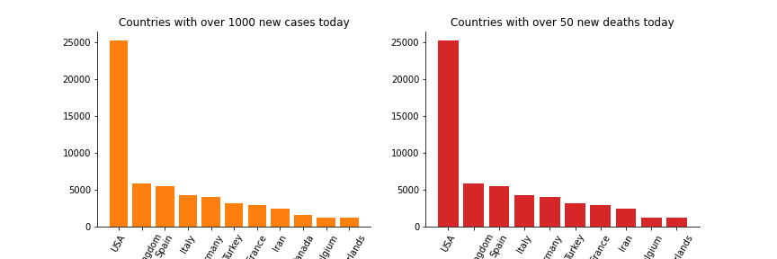
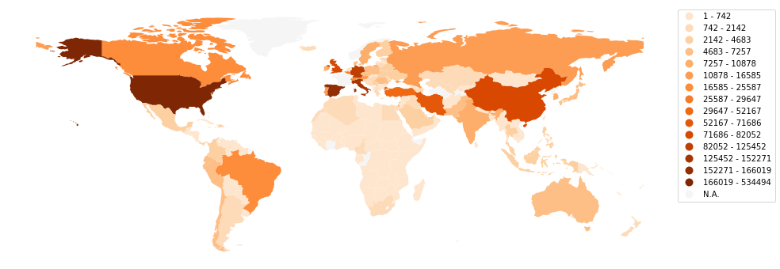
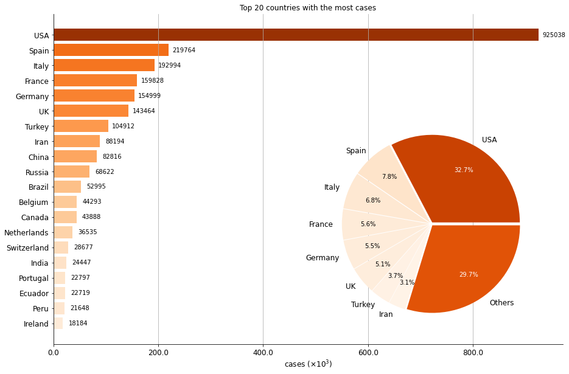
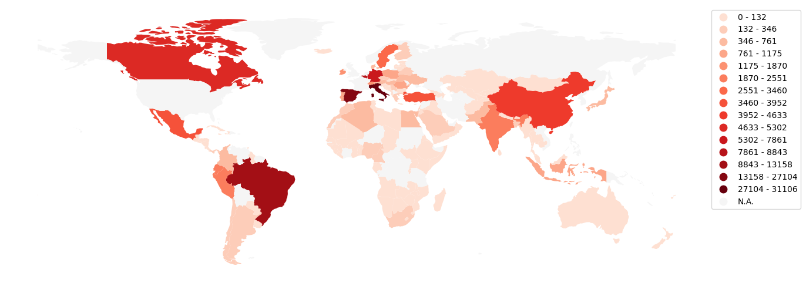
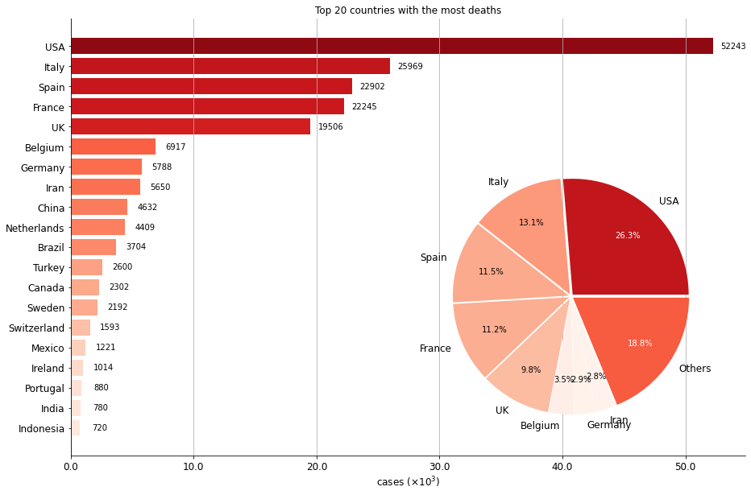
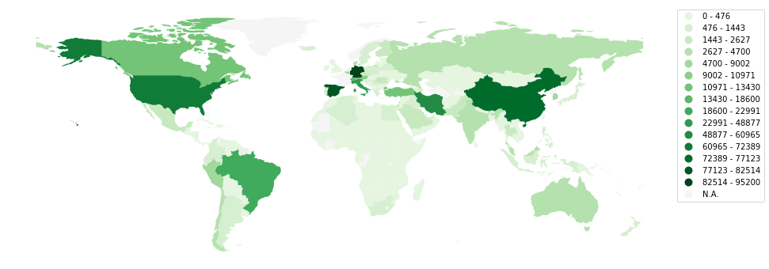
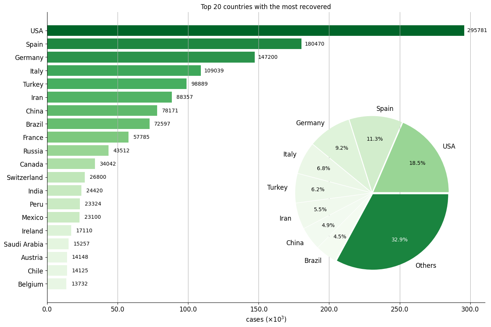

# covid-19-trend

Visualization of the COVID-19 trend with Matplotlib and GeoPandas
# Contents
- [Figures](#figures)
  - [Today's Summary](#today's-summary)
  - [Global Situation](#global-situation)
  - [Country Timeline](#country-timeline)
- [Sources](#sources)
  - [Data](#data)
  -	[Others](#others)
# Figures
### Today's Summary

|   Cases | Recovered | Deaths | New Cases | New Deaths | Active Cases | Serious Cases |
| ------: | --------: | -----: | --------: | ---------: | -----------: | ------------: |
| 1265030 |    255118 |  69171 |     71124 |       4725 |       934324 |         45441 |

### Global Situation

- _**Total cases**_

- _**Total deaths**_

- _**Total recovered**_

### Country Timeline
Please see [timeline.md](timeline.md).
# Sources
### Data
- [Coronavirus Tracker](https://thevirustracker.com/)
- [CSSEGISandData/COVID-19](https://github.com/CSSEGISandData/COVID-19)
- [BNO NEWS](https://bnonews.com/index.php/2020/04/the-latest-coronavirus-cases/)
- [pomber/covid19](https://github.com/pomber/covid19)
### Others
- [ISO 3166](https://www.iso.org/glossary-for-iso-3166.html)